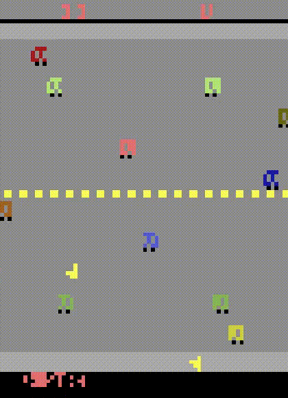

# SimPLe PyTorch

PyTorch implementation of the *SimPLe* algorithm for the Arcade Learning Environment's Atari 2600 games.

Based on the paper [Model-Based Reinforcement Learning for Atari](https://arxiv.org/abs/1903.00374).

- [Installation](#installation)
- [How to use](#how-to-use)
- [Per-environment performance](#per-environment-performance)



*SimPLe predicting 46 frames in the future from 4 initial frames on Freeway.*

## Installation

This program uses **python 3.7**, **CUDA 10.2** if enabled, and was tested on Ubuntu 20.04.1.

Run the following command to install the dependencies:
  ```shell script
  pip install torch==1.7.0 gym==0.15.7 gym[atari] opencv-python==4.4.0.42 tqdm==4.49.0 numpy==1.16.4
  
  git clone https://github.com/openai/baselines.git
  cd baselines
  pip install -e .
  ```

### Install wandb (optional)

You can use [wandb](https://www.wandb.com/) to track your experiments:
```shell script
pip install wandb
```

To use wandb, pass the flag `--use-wandb` when running the program. See [How to use](#how-to-use) for more details about flags.

## How to use

CUDA is enabled by default, see the following section to disable it.

To run the program, run the following command from the folder containing the `simple` package:
```shell script
python -m simple
```

### Disable CUDA

To disable CUDA, pass the flag `--device cpu` to the command line. See the next section for more information about flags.

### Flags

You can pass multiple flags to the command line, a summary is printed at launch time.
The most useful flags are described in the following table:

| Flag | Value | Default | Description |
| ---- | ----- | ------- | ----------- |
| --agents | Any positive integer | 16 | The number of parallel environments to train the PPO agent on |
| --device | Any string accepted by [torch.device](https://pytorch.org/docs/stable/tensor_attributes.html#device-doc) | cuda | Sets the PyTorch's device |
| --env-name | Any game name (without the suffixes) as depicted [here](https://gym.openai.com/envs/#atari) | Freeway | Sets the gym environment | 

The following boolean flags are set to `False` if not passed to the command line:

| Flag | Description |
| ---- | ----------- |
| --load-models | Loads models from `simple/models/` and bypasses training |
| --render-evaluation | Renders the environments during evaluation |
| --render-training | Renders the environments during training |
| --save-models | Save the models after each epoch |
| --use-wandb | Enables [wandb](https://www.wandb.com/) to track the experiment |

For example, to run the program without CUDA and to render the environments during training, run:
```shell script
python -m simple --device cpu --render-training
```

## Per-environment performance

The scores* obtained with this implementation are detailed in the following table:

| Environment | Score | Paper's score | % of reported score in the original paper |
| ----------- | ---:  | ---:          | ---:                                      |
| Freeway | 22.1 | 20.3 | 108.9% |
| Kangaroo (deterministic) | 466.7 | 481.9 | 96.8% |
| Krull | 3418.2 | 4539.9 | 82.6% |
| MsPacman | 681.3 | 762.8 | 89.3% | 

**Scores obtained on only one full training per environment. More numbers to come.*